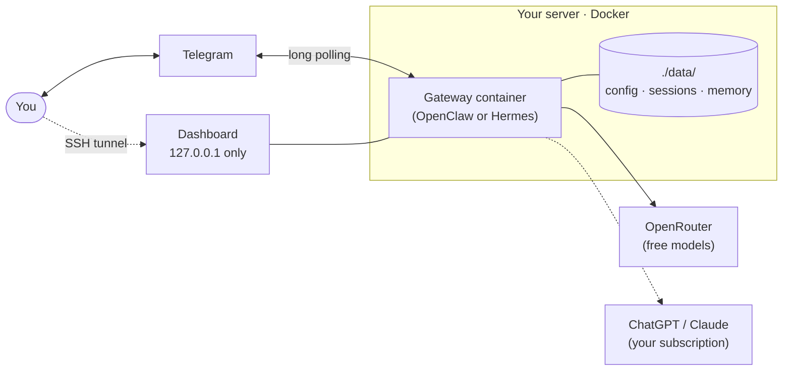

# Lona

**Your personal AI assistant, self-hosted with one command.**

Lona is a batteries-included deployment kit for [OpenClaw](https://openclaw.ai) and [Hermes Agent](https://github.com/NousResearch/hermes-agent) — two of the leading open-source personal AI assistant platforms. Pick one, run one command on any Linux server, and talk to your assistant on Telegram minutes later.

[](LICENSE)
[](https://openclaw.ai)
[](https://github.com/NousResearch/hermes-agent)

## Highlights

- **One command, zero manual setup** — `./deploy.sh openclaw` or `./deploy.sh hermes` handles Docker installation, secret generation, config seeding, and startup
- **Free by default** — ships configured for OpenRouter's free-model router with automatic failover; runs at $0/month
- **Subscription-powered coding** — use your existing ChatGPT Plus/Pro or Claude Pro/Max plan as the assistant's brain, no API billing
- **Telegram-native** — DMs, groups, and forum topics (each topic is an isolated session); long-polling means no inbound ports and works behind NAT
- **Secure defaults** — deny-by-default access control, loopback-only dashboards, auto-generated secrets, secrets never committed
- **Portable state** — everything lives in `./data/`; back up, migrate, or wipe with a single directory

## Architecture



## Quick start

### Prerequisites

| | Where to get it |
|---|---|
| A Linux server (or any machine with Docker) | any VPS provider — 1 vCPU / 1 GB is enough |
| OpenRouter API key | [openrouter.ai/keys](https://openrouter.ai/keys) — free, no credit card |
| Telegram bot token | DM [@BotFather](https://t.me/BotFather) → `/newbot` |
| Your Telegram user id | DM [@userinfobot](https://t.me/userinfobot) |

### Fresh server — one line

```bash
curl -fsSL https://raw.githubusercontent.com/duthaho/lona/main/scripts/bootstrap.sh | bash -s -- openclaw
```

Installs git and Docker if missing, clones this repo to `~/lona`, and runs the deploy. Use `hermes` instead of `openclaw` to pick the other platform.

### Machine with Docker

```bash
git clone https://github.com/duthaho/lona.git && cd lona
./deploy.sh openclaw          # or: ./deploy.sh hermes
```

First run prompts for your OpenRouter key and Telegram token, generates auth secrets, seeds the config, pulls the image, and starts the gateway. Then just DM your bot.

## Commands

```
./deploy.sh <openclaw|hermes> [action]
```

| Action | Description |
|---|---|
| `up` *(default)* | Install prerequisites, seed config, pull image, start |
| `down` / `restart` | Stop / restart |
| `logs` | Follow container logs |
| `status` | Container status |
| `config` | Edit the platform config in `$EDITOR`, apply on save |
| `update` | Pull the latest image and recreate |
| `backup` | Archive `./data/<platform>` into `./backups/` |
| `doctor` | Probe the model chain's health (see [Chain health](#chain-health)) |
| `cli …` | Run the platform's own CLI inside the container |

## Models

### Free tier (default)

Both platforms ship with a **curated chain of free models**, ordered for reliability first:

1. `nvidia/nemotron-3-ultra-550b-a55b:free` — strong agentic reasoner, 1M context, hosted by NVIDIA itself so it's rarely rate-limited
2. `z-ai/glm-5.2:free` — the smartest free model by [Artificial Analysis](https://artificialanalysis.ai) index, but its single provider is frequently congested (429s), so it serves as fallback / manual switch
3. `nvidia/nemotron-3-super-120b-a12b:free` / `google/gemma-4-31b-it:free` — additional fallbacks (Gemma adds vision)

We deliberately avoid OpenRouter's `openrouter/free` auto-router: it picks free models *at random*, including tiny low-quality ones.

**Gemini for free:** OpenRouter's free pool no longer carries Gemini/DeepSeek/Grok, but Google's own [AI Studio](https://aistudio.google.com) key has a generous free tier. Set `GOOGLE_API_KEY` in `.env` and switch the model to `gemini-3.6-flash` (both platforms support it natively — see the config templates; older Gemini 2.5 models are closed to new API users).

> **Quota note:** OpenRouter's free-tier daily cap is per *account*, not per model. A one-time $10 credit purchase raises it to 1,000 requests/day — the best value upgrade for a personal assistant. Free model ids rotate; browse [openrouter.ai/models?max_price=0](https://openrouter.ai/models?max_price=0).

### Chain health

Free model ids rotate and their hosts congest — and a dead chain fails *silently*. The built-in doctor makes it observable:

```bash
./deploy.sh <platform> doctor            # listing check on every model + 1-token probe of the primary
./deploy.sh <platform> doctor --deep     # 1-token probe of every model (one free-tier request each)
./deploy.sh <platform> doctor install    # cron every 6h, DMs you on Telegram when health changes
./deploy.sh <platform> doctor uninstall  # remove the cron entry
```

Statuses: `OK` · `DEAD` (id rotated/removed) · `LIMITED` (429 congestion) · `ERROR`. Exit codes: `0` healthy, `1` a fallback is degraded, `2` the primary is unusable. The zero-cost listing check also runs automatically after every `up`/`update` (warn-only). The default probe costs one free-tier request; a `DEAD` id is caught by the free listing tier and never probed. A transient `ERROR` (timeout / 5xx) is retried once before it counts, so a momentary blip doesn't cry wolf; a real `LIMITED` (429) is reported immediately, never retried (tune with `DOCTOR_PROBE_RETRIES`, default 1). Alerts fire only on state *change* (including recovery) — a persistent outage won't spam you. Schedule via `DOCTOR_CRON_SCHEDULE` in `.env`. The doctor never modifies your config.

### Your subscription (recommended for coding)

Free models handle chat well but lag on agentic coding. If you already pay for **ChatGPT Plus/Pro** or **Claude Pro/Max**, both platforms can use those plans directly — headless-friendly login included:

```bash
./deploy.sh openclaw cli models auth login --provider openai     # ChatGPT → OpenClaw
./deploy.sh hermes cli auth add openai-codex                     # ChatGPT → Hermes
```

Full setup, the Claude paths, and platform caveats: **[docs/subscriptions.md](docs/subscriptions.md)**.

## Telegram access control

| | OpenClaw | Hermes |
|---|---|---|
| **DMs** | Allowlist: `TELEGRAM_ALLOWED_USERS` (injected on `up`; first id becomes command owner). Empty → pairing: stranger gets a code, you approve it | Allowlist: `TELEGRAM_ALLOWED_USERS` |
| **Groups** | Group allowlist, injected by deploy.sh from `TELEGRAM_GROUP_ALLOWED_CHATS` | Your allowlisted users work instantly; add the group id to open it to all members |
| **Group noise** | `requireMention: true` set per injected group | `require_mention: true` set in the template |
| **Forum topics** | Own session per topic; per-topic agent override | Own session per topic; per-topic skill binding |

To use the bot in a group: disable privacy mode in @BotFather (`/setprivacy`) or make the bot an admin, **remove and re-add the bot**, grab the chat id from `logs`, set `TELEGRAM_GROUP_ALLOWED_CHATS` in `.env`, and run `up`.

## Day-2 operations

| Task | How |
|---|---|
| Change model, channels, skills | `./deploy.sh <platform> config` |
| Change secrets or ports (`.env`) | edit `.env`, then `./deploy.sh <platform> up` (recreate — `restart` won't pick up env) |
| Upgrade platform version | `./deploy.sh <platform> update` — **run this regularly**: OpenClaw shipped a critical pairing privilege-escalation fix in 2026.3.28 ([CVE-2026-33579](https://nvd.nist.gov/vuln/detail/CVE-2026-33579)); staying current is the security baseline |
| Security check (OpenClaw) | runs automatically on `up`/`update`; manual: `./deploy.sh openclaw cli security audit --deep` |
| Back up all state | `./deploy.sh <platform> backup` |
| Check model-chain health | `./deploy.sh <platform> doctor` — or `doctor install` for scheduled checks with Telegram alerts |
| Switch platforms | `./deploy.sh openclaw down && ./deploy.sh hermes` — shared `.env`. Hermes can import OpenClaw state: `./deploy.sh hermes cli claw migrate` |
| Open the dashboard | `ssh -L 18789:127.0.0.1:18789 user@vps` (OpenClaw) / `ssh -L 9119:127.0.0.1:9119 user@vps` (Hermes) |

## Security model

- **Network:** only Telegram long-polling leaves the box; dashboards bind to loopback and are reached via SSH tunnel. Expose them only behind a TLS reverse proxy (change `OPENCLAW_BIND` / `HERMES_DASHBOARD_BIND`).
- **Access:** deny-by-default on both platforms — unknown Telegram users are blocked, groups must be allowlisted. OpenClaw DMs prefer an explicit numeric allowlist over pairing (the upstream-recommended one-owner setup), and each DM sender gets an isolated session.
- **Blast radius:** free models are markedly easier to prompt-inject than frontier ones, so the OpenClaw template ships with workspace-only filesystem access and elevated tools disabled, and the Hermes template caps tool-loop iterations and hard-stops runaway loops. All of it is plain config — relax per agent once you move to a stronger model.
- **Audit:** `deploy.sh` runs OpenClaw's built-in `security audit --fix` after every `up`/`update` (tightens file permissions, flips risky open policies to allowlists).
- **Updates:** `:latest` images + `./deploy.sh <platform> update` on a regular cadence — the 2026 OpenClaw pairing CVE was fixed upstream within days; deployed boxes only got the fix by pulling.
- **Secrets:** generated automatically, stored only in `.env` (`chmod 600`, git-ignored); OAuth tokens persist in git-ignored `./data/`.

## Repository layout

```
deploy.sh                      One-command deploy and management
docker-compose.yml             Both platforms as Compose profiles
.env.example                   Single configuration template
config/
  openclaw/openclaw.json       OpenClaw template (seeded to data/ on first run)
  hermes/config.yaml           Hermes template (seeded to data/ on first run)
scripts/bootstrap.sh           curl-able installer for a fresh server
scripts/doctor.sh              Model-chain health checks (./deploy.sh <p> doctor)
docs/subscriptions.md          Using ChatGPT / Claude plans instead of API keys
tests/                         Shell test suite (bash tests/run.sh)
data/                          Runtime state (git-ignored)
```

## License

[MIT](LICENSE)
